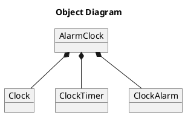

# Getting Started

## Github Template Repository - Quickstart
We have a [Github Template Repository](https://github.com/Coffee2Bits/AaC-User-Template-Repository) that's setup to allow users exploring AaC to immediately create an AaC-ready github repository and development environment using [Gitpod](gitpod.io).

The repository is pre-populated with a simple example model and Github Action workflow. All that you have to do is hit the "Use this Template" button at the top of the template repository. 


## Installing AaC
If you're not using a prepared environment, then you will need to install AaC and its python dependencies. AaC is written in Python to help make it more approachable for casual users and easily extensible for power users.
**You will need Python 3.9 or later to run AaC.**

To install AaC on Linux, Windows, or macOS:
```bash
pip install aac
```

Usage information is available from the command line interface:
```bash
aac --help
```

Installed `aac` executable version information is available via  the `version` command:
```bash
aac version
```

AaC user features, any command that you use, are managed and implemented via a plugin architecture. This allows for small footprints for user features and an ability for users to completely customize their tooling and environment to their needs.

## Built-in Commands
AaC does have two universal commands that are always present:
- validate:  Ensures your model is correctly defined per the AaC DSL
- version: Get the version of the AaC package installed

## First-Party Plugins
First-party plugins are user features that are built and maintained by the AaC development team. They receive first-class support such as unit and functional tests within the AaC repository and CI/CD pipeline. These plugins are special because they are **ALWAYS** packaged with the AaC package.

## Third-Party Plugins
Third-party plugins are plugins built by third party developers and are outside the control of the AaC development team. These third party plugins have to be installed via pip in order to correctly register the plugin's command and functionality.

### Installing Plugins
Install third-party plugins is easy with pip.

To install an AaC Plugin on Linux, Windows, or macOS:
```bash
pip install <aac-plugin>
```

If the plugin provides new command functionality you will see the details in the usage information if the plugin was correctly installed.
```bash
aac --help
```

# Using AaC to Model Your System
The general pattern for decomposing whatever you want to model is to ask questions of the system and correlate those results to AaC definitions. For example:
* If you want to define your things you would create a `model` definition
* If you want to define your data structures you would create a `schem` definition
* If you want to define the interfaces between your things (models) you would populate the `behavior` field in your `model`s.
* If you want to define the interactions between your things (models) you would create a `usecase` definition incorporating the steps and actors of those interactions.

# Define Your First Model
Because AaC is an MBSE tool, `model` is a pretty central item to define. Let's take an example of an alarm clock, create a new file in an AaC environment like such:

_src/model/alarm_clock.yaml_
```yaml
model:
  name: AlarmClock
  description: A simple alarm clock model
```

Now, if you run the validation command:
`aac validate src/model/alarm_clock.yaml` you'll see a message indicating that your model is valid.

That's too simplistic, let's decompose our alarm clock system into components -- what makes up our alarm clock? Let's say that there are three parts to our alarm clock, the internal clock, the timer for the alarm, and the alarm itself. We can define those three components as models that are components of our `AlarmClock` model like such:

_src/model/alarm_clock.yaml_
```yaml
model:
  name: AlarmClock
  description: A simple alarm clock model
  components:
    - name: clock
      type: Clock
    - name: timer
      type: ClockTimer
    - name: alarm
      type: ClockAlarm
---
model:
  name: Clock
  description: A simple clock that keeps track of the current time
---
model:
  name: ClockTimer
  description: A simple timer that can be set to a target time.
---
model:
  name: ClockAlarm
  description: A simple alarm that produces noise.
```

Once again, we can check to see that this model is valid. Even better, we can use something this simple to start driving value. We can generate a simple object diagram by using the first-party plugin GenPlantUML with the command `aac puml-object alarm_clock.yaml --output_directory diagrams` which will generate a file with the following PlantUML content:

_diagrams/object/alarm_clock_alarm_clock.puml_


More interestingly, this PlantUML diagram produces the following graphic when rendered:


# Define a Data Structure
Now that we have a basic alarm clock and some components, we can start defining the data structures that will be used in our example model. What better data for an alarm clock than a timestamp? We can define our timestamp data structure with the `schema` tag like so:

_src/model/data_structures.yaml_
```yaml
schema:
  name: TimestampDataStructure
  fields:
    - name: hour
      type: int
    - name: minute
      type: int
    - name: second
      type: int
    - name: year
      type: int
    - name: month
      type: int
    - name: day
      type: int
```

Defining a data structure by itself isn't particularly useful, but we can reference this data structure in our models to define state or interfaces.

If we return to our alarm clock model, we can define that the timer component is stateful -- the function of the timer is influenced by the time provided by the user. This is easily defined by giving the `ClockTimer` model some state that includes the timestamp we just defined.

_src/model/alarm_clock.yaml_
```yaml
model:
  name: ClockTimer
  description: A simple timer that can be set to a target time.
  state:
    - name: targetTime
      type: TimestampDataStructure
      description: The target timestamp indicating when to fire an alert to the alarm component.
```

# Defining Model Interfaces
Data structures are also used when defining interfaces between models/components of your system. What these interfaces translate to is highly dependent on your needs and which plugins you're using. For instance, the GenProtobuf plugin identifies the data structures defined in `model.behavior` fields and generates Protobuf3 equivalent messages for use in software messaging/communication.

If we return to our alarm clock example, then we can define the interface to our alarm system. In this example we'll re-use the timestamp data structure for simplicity since it fairly represents the data that we'd expect a user to provide to an alarm clock:

_src/model/alarm_clock.yaml_
```yaml
model:
  name: AlarmClock
  description: A simple alarm clock model
  components:
    - name: clock
      type: Clock
    - name: timer
      type: ClockTimer
    - name: alarm
      type: ClockAlarm
  behavior:
    - name: setAlarm
      type: request-response
      description: Set the alarm timer
      input:
        - name: targetTime
          type: TimestampDataStructure
```

If we were to generate a component diagram from our model at this point, we'll be able to visualize the components and interfaces of our alarm clock model.

If we run the command `aac puml-component alarm_clock.yaml --output_directory diagrams` to generate a component diagram, the resulting diagram will render to something like this:


# Defining the Interactions Between Models
Finally, we can also model the interactions between our models; say that we want to define the scenario when a user sets the time on the alarm clock. These interactions are defined by using the `usecase` root key, listing the actors in our `usecase` under `usecase.participants`, and the steps that are involved in the `usecase` under `usecase.steps`.

For example, if we were to model the usecase of a user setting the alarm on our alarm clock, it might look something like:

_src/model/alarm_clock/usecase.yaml_
```yaml
import:
  - ./alarm_clock.yaml
  - ./external.yaml
usecase:
  name: Set Alarm Time
  description: The user sets the time for the alarm clock.
  participants:
    - name: user
      type: Person
    - name: alarm
      type: AlarmClock
    - name: timer
      type: ClockTimer
  steps:
    - step: The user sets the time on system.
      source: user
      target: alarm
      action: setAlarm
    - step: The alarm clock stores the time in the timer
      source: alarm
      target: timer
      action: setTime
```

The file `external.yaml` has a simple model definition for our external user, who is an actor on our system but one that we don't have to pay much mind when it comes to modeling.

_src/model/alarm_clock/external.yaml_
```yaml
model:
  name: Person
  description: A representation of users/people external to the alarm clock system.
```

With that usecase defined, we can generate a PlantUML sequence diagram `aac puml-sequence usecase.yaml --output_directory diagrams`, which renders to:


Voila! You've covered the basic parts of Architecture-as-Code!