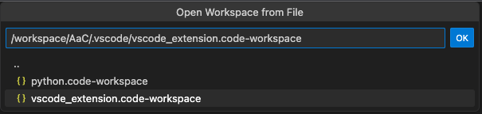

# Debugging AaC In Gitpod

The AaC repository is pre-configured for immediate development in Gitpod environments leveraging VSCode, but these steps will work in local environments as well.

## Opening AaC In Gitpod

There are several ways to open the repository in Gitpod, the easiest is to click the Gitpod 'Ready-to-Code' button in the readme.

The [Gitpod Browser Extension](https://www.gitpod.io/docs/configure/user-settings/browser-extension) allows a user to simply click the new `Gitpod` button visible in the AaC repository.

For more information check out the [Gitpod documentation](https://www.gitpod.io/docs/introduction/getting-started).

## Debugging the AaC Python Project

The AaC Python project has several debug tasks pre-configured for VSCode in the `.vscode/python.code-workspace` configuration file. Open the Python project in VSCode by opening the VSCode command prompt via the `F1` button, or `function + F1` (on MacOS), and then typing 'open' or 'open workspace' to see the `File: Open Workspace from File...`  command option.

When the option to open a workspace file is available, navigate to the top-level `.vscode/` directory and select the Python project configuration.

After the Python workspace has been opened, select the VSCode debug icon in the left-hand activity bar and run one of the number of debug configurations.

## Debugging the AaC VSCode Project

The AaC Python VSCode Extension project can be run in debug mode via its pre-configured VSCode project in the `.vscode/vscode_extension.code-workspace` file. Open the VSCode extension project in VSCode by opening the VSCode command prompt via the `F1` button, or `function + F1` (on MacOS), and then typing 'open' or 'open workspace' to see the `File: Open Workspace from File...`  command option.

When the option to open a workspace file is available, navigate to the top-level `.vscode/` directory and select the VSCode extension project configuration.

After the VScode extension workspace has been opened, open any TypeScript file (e.g. `extension.ts`) and debug using the `F5` button, or `function + F5` (on MacOS). Choose `VS Code Extension Development` from the selection of debug options, which should open another tab of Gitpod or instance of VSCode running the extension in debug mode.

If any breakpoints are set in the VSCode extension files, the debugger will stop in the primary Gitpod or VSCode instance.
