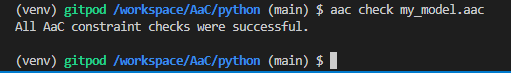

# Check

The `check` plugin evaluates an AaC model against the AaC constraints.  The `check` plugin will output any errors that are found.

## Check Command



## Arguments

### Fail on Warn

The `--fail-on-warn` argument will cause the check command to return a failure if a warning is encountered.  This can be useful in your CI/CD pipeline to ensure that no warnings are present in your model.

### Verbose

The `--verbose` argument will output the results of all constraints evaluated, regardless of the level.  This can be useful for debugging.

## Help

```bash
$ aac check -h
Usage: aac check [OPTIONS] AAC_FILE

Options:
  --fail-on-warn  The check command will fail if encountering fail or warn
                  constraint violations.
  --verbose       Provide ouput for all constraints evaluated.
  -h, --help      Show this message and exit.
```
