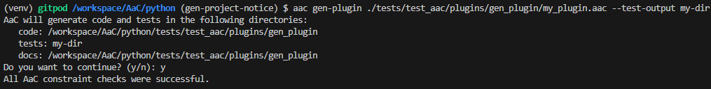
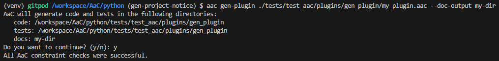
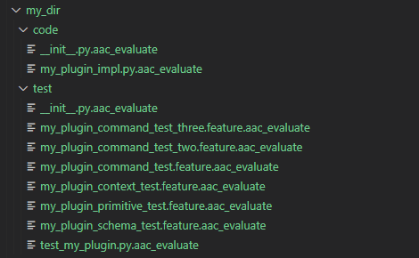
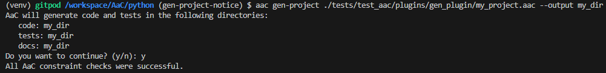
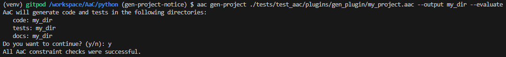

# Generate Plugin

The `gen-plugin` plugin generates the boilerplate integration code for your modeled AaC plugin.  This supports generation of a new AaC project or plugin(s) within an existing project.  This will ensure that your plugin is properly integrated with the AaC framework and can be used by the AaC CLI.  Generated plugins provide the code infrastructure for you to define new AaC commands and constraints by completing stubbed out functions.

## Gen-Plugin Command

## Arguments

### AaC Plugin FIle

The AaC file containing the plugin definition.

### Code Output

The `--code-output` argument tells the generator the directory to put your generated code.  This will be the root of the package directory structure.

### Test Output

The `--test-output` argument tells the generator the directory to put your generated tests.  This will be the root of the test directory structure.

### Doc Output

The `--doc-output` argument tells the generator the directory to put your generated documentation.  _This is currently not used but may be in the future._

### No Prompt

The `--no-prompt` argument tells the generator to not ask the user to confirm the output directories.  This may be useful for CI/CD pipelines if you're generating plugin content automatically.

### Force Overwrite

The `--force-overwrite` argument tells the generator to overwrite all files (while still making a backup), rather than output `.aac_evaluate` files for user-editable files.

### Evaluate

The `--evaluate` argument tells the generator to only output `.aac_evaluate` files for all generated files, rather than overwriting them.

## Help

## Gen-Project Command

Generate code and stubs for an AaC project.  Overwrites will backup existing files.

## Optional Arguments

### AaC Plugin FIle

The AaC file containing the plugin definition.

### Output

The `--output` argument tells the generator the directory to put your generated project code.

### No Prompt

The `--no-prompt` argument tells the generator to not ask the user to confirm the output directories.  This may be useful for CI/CD pipelines if you're generating plugin content automatically.

### Force Overwrite

The `--force-overwrite` argument tells the generator to overwrite all files (while still making a backup), rather than output `.aac_evaluate` files for user-editable files.

### Evaluate

The `--evaluate` argument tells the generator to only output `.aac_evaluate` files for all generated files, rather than overwriting them.

## Help

