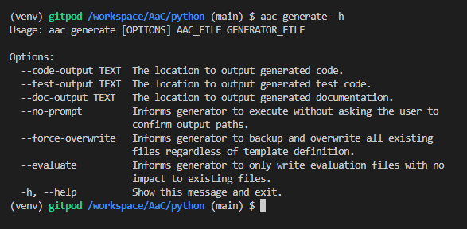
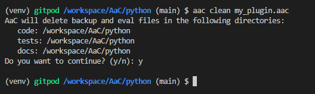
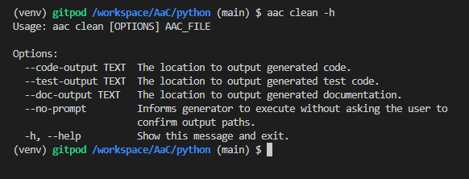

# Generate

Plugin providing content generation and clean-up.

## Generate Command

The `generate` plugin provides a content generation capability for use in user-defined plugins.  It can be used to generate any text file from a model.
As of right now, it cannot be used cleanly from the command line, and must be called through the `run_generate()` function.

```python
from aac.plugins.generate import run_generate

def generate_command(my_model: str, my_generator: str):
    run_generate(my_model, my_generator)
```

### Arguments

#### AaC File

The AaC file containing the model definition.

#### Generator File

The AaC file containing the generator definition(s).

#### Code Output

The `--code-output` argument tells the generator the directory to put your generated code.  This will be the root of the package directory structure.

#### Test Output

The `--test-output` argument tells the generator the directory to put your generated tests.  This will be the root of the test directory structure.

#### Doc Output

The `--doc-output` argument tells the generator the directory to put your generated documentation.  _This is currently not used but may be in the future._

#### No Prompt

The `--no-prompt` argument tells the generator to not ask the user to confirm the output directories.  This may be useful for CI/CD pipelines if you're generating content automatically.

#### Force Overwrite

The `--force-overwrite` argument tells the generator to overwrite all files (while still making a backup), rather than output `.aac_evaluate` files for user-editable files.

#### Evaluate

The `--evaluate` argument tells the generator to only output `.aac_evaluate` files for all generated files, rather than overwriting them.

### Help



## Clean Command

The `clean` command will clean-up any `.aac_backup` and `.aac_evaluate` files that may be "left over" from your plugin generation work.



### Arguments

#### AaC Plugin File

The AaC file containing the model definition.

#### Code Output

The `--code-output` argument tells the cleaner where code backup and evaluate content may be found.  This will be the root of the package directory structure.

#### Test Output

The `--test-output` argument tells the cleaner where test backup and evaluate content may be found.  This will be the root of the test directory structure.

#### Doc Output

The `--doc-output` argument tells the cleaner where documentation backup and evaluate content may be found.  _This is currently not used but may be in the future._

#### No Prompt

The `--no-prompt` argument tells the generator to not ask the user to confirm the directories.  This may be useful for CI/CD pipelines if you're generating and cleaning content content automatically.

### Help


