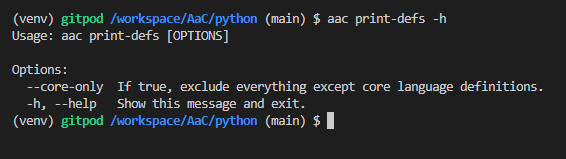

# Print Definitions

Prints all AaC definitions from the Language Context.  This is useful for debugging or may serve as a reminder of the definitions available.

## Print-Defs Command

Inputting the above command will output the following to terminal:

## Arguments

### Core Only

The `--core-only` argument will exclude everything except core language definitions.

## Help

