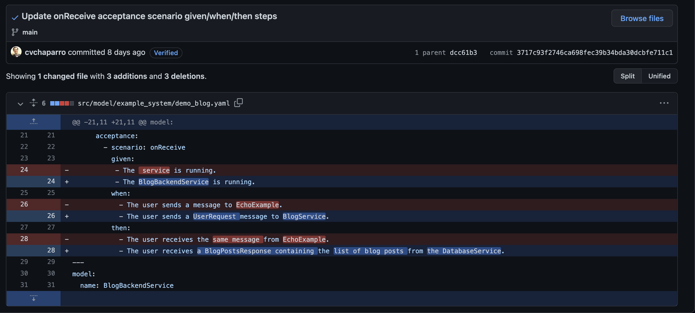

# Configuration Management
One of the main benefits of using Architecture-as-Code is that your models and systems are stored in plain-text YAML files instead of binary or database formats. Storing models as plain-text allows version control tools, like Git, to easily track and manage changes to your models and systems. Leveraging tools like Git opens modeling teams to using software development practices such as [feature branch workflows](https://www.atlassian.com/git/tutorials/comparing-workflows/feature-branch-workflow) to enable parallel development of the models or systems.

## VCS Commits and History
For those who aren't familiar with how version control software works, the general idea is that it works by taking user-specified snapshots of files in a project/repository called "commits". The commits are given unique identifiers called hashes, and are used to track the state of files over time. Git is arguably the most popular VCS in use, and there are a number of tools that provide a more collaborative interface for managing Git projects like Github, Bitbucket, GitlabCI, Gitea, etc. All of these tools have similar, foundational features such as visual diffs of version history -- this allows for tracking every change to a model or system.

Here is an example of the visual diff of changes made to an AaC model in a Github Repository.

## Leveraging AaC in CI/CD pipelines
Architecture-as-Code not only allows users to leverage the power of version-control tools like Git for systems modeling, but it also enables users to leverage Continuous Integration/Continuous Delivery pipelines.
