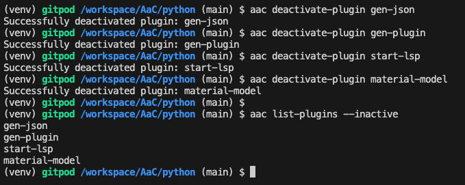
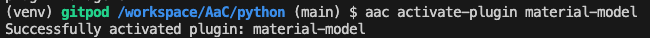
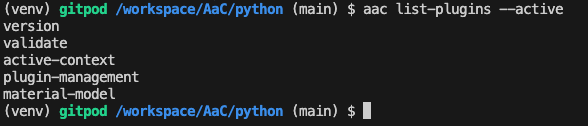
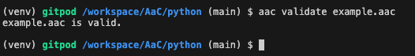
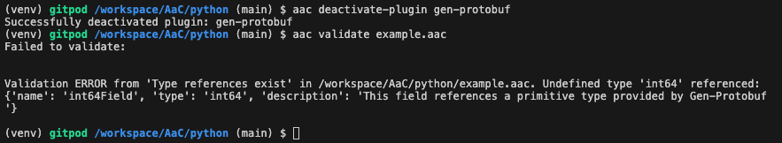

# Contributing Definitions to a User Library
One of the primary contributions that AaC plugins provide are sets of AaC definitions that can be leveraged by users in their modeled systems. For instance, an organization may have a common set of model components that they wish to share amongst teams as an internal library. AaC plugins provide users with a distributable, immutable set of definitions that can also be distributed alongside the AaC tool via the pip package manager tool.

To understand more about definitions and their role in AaC, see the [Definitions](#definitions) section of the AaC Modeling Language Reference page.

While AaC plugins aren't limited to only contributing definitions, this is the only plugin functionality necessary to create a distributable user library for the AaC tool. In order to support user libraries, plugins include their definitions as part of their registration in AaC. For references on how to register an AaC plugin, see [Plugin Developer Guide](../dev_guide/plugin_dev_guide)

## Inactive User Library Plugin
When a plugin has definitions associated with it, but the plugin has not been activated, the definitions are not available for use by AaC. To confirm a plugin has been installed, but not activated, run the following command: `aac --inactive`.


## Active User Library Plugin
In order to use the definitions in a user library plugin, you must make sure that it is actively contributing definitions to the context.

You can activate a registered plugin by using the following command: `aac activate-plugin <plugin name>`.



Verify the plugin has been activated by running the following command: `aac --active`



Once you have verified that your plugin has been activated, you are able begin referencing the definitions in your plugin.

To demonstrate this behavior, take this example aac file:
```yaml
schema:
    name: ProtobufTypeExample
    fields:
        - name: int64Field
          type: int64
          description: This field references a primitive type provided by Gen-Protobuf
```

It references a type `int64` provided by the plugin `gen-protobuf`. If we validate this file with the plugin active, it'll successfully validate.


If we deactivate `gen-protobuf` and run the validation again, we'll see an error indicating our plugin type isn't defined.



# Contributing Root Keys to a User Library
AaC uses a set of root-level keys to define instances of modeled 'things' that are defined data structures (schemas). An example is the root key `schema`, which defines an instance of a data structure that can be referenced. The core AaC specification has several root keys, but users are capable of defining custom root keys.  Custom root keys allow users to define instances of models or modeled components. For more information on pre-defined Root Keys, see the [Root Keys](./aac_language/#dsl-root-keys) section of the AaC Modeling Language Reference page.

## Defining, adding, and leveraging a Root Key
Due to AaC's self-defining design, users must extend the `root` definition because each field is a mapping of a root key to its defined structure. See [Definition Extensions](../advanced_user_topics/language_extensions.md) for more information on extending definitions in AaC.
There is information and examples about how the core spec is utilized and how to extend the DSL for use via an additional plugin within the [Base DSL and Extended DSL](./aac_language/#the-base-dsl-core-spec) sections of the AaC Modeling Language Reference page.

For a plugin to provide custom root keys, it must have a `schemaExt` type extension targeting the `root` definition providing additional fields to the `root` definition. Each new field in the `root` definition defines a root key and corresponding data structure in the AaC language. User Library key roots can be used to define instances of modeled things such as cars, furniture, electronic networks, cloud networks, etc.

*Be aware, plugins not intentionally built to process the data modeled in a User Library will likely be incompatible with any new root keys and data structures. Such incompatibilities can lead to generating incomplete artifacts.*

# Note to Plugin Developers
Currently AaC does not have a plugin system capable of defining dependencies across plugins. If a plugin implements a User Library (another plugin), the onus of managing dependencies and versions rests entirely on the users and developers. There is future functionality to address these shortcomings. For now, clear communication, documentation, and dependency files (e.g. requirements.txt, poetry.lock, setup.py, etc) are the best way to mitigate dependency issues.
