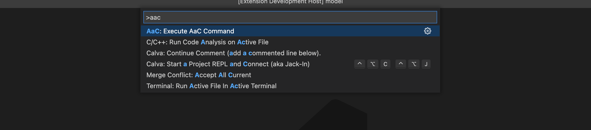
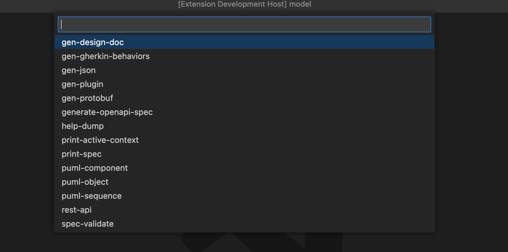
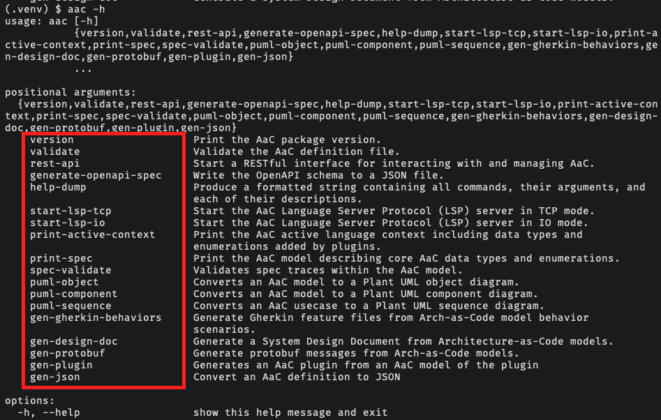
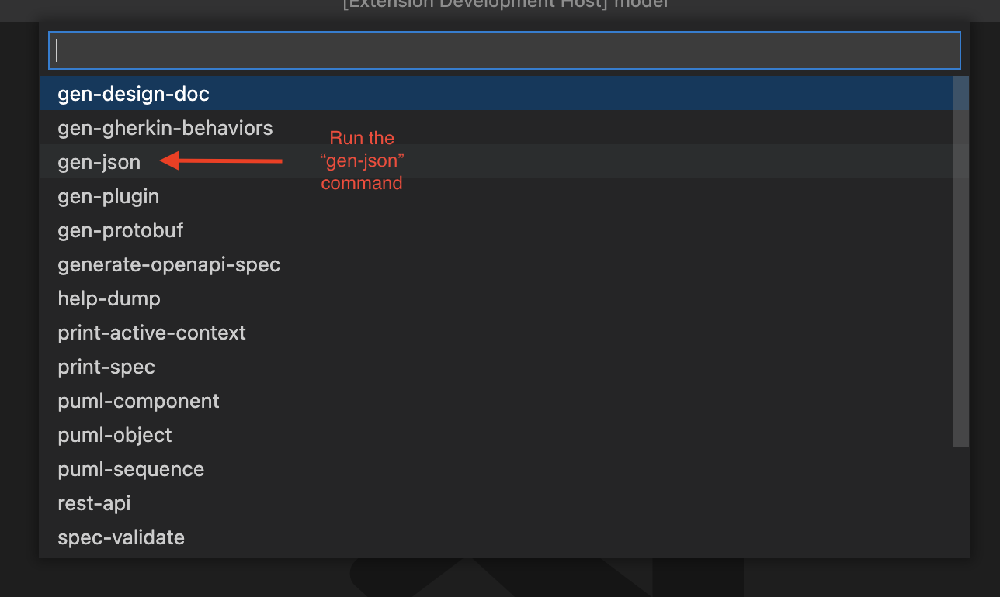
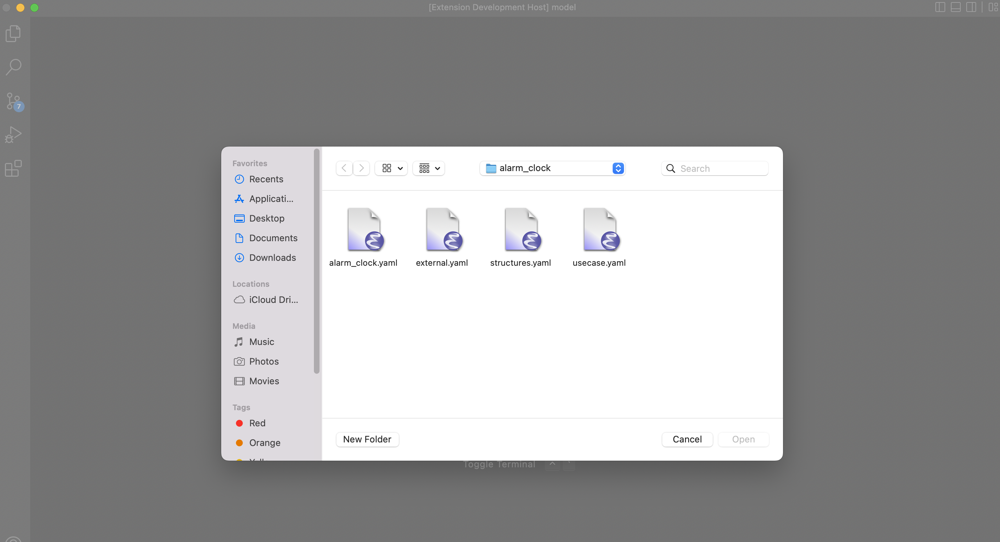
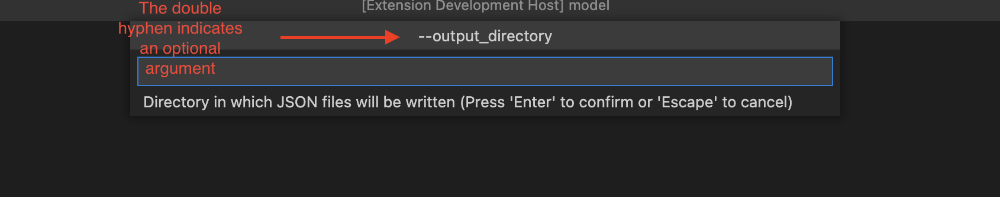
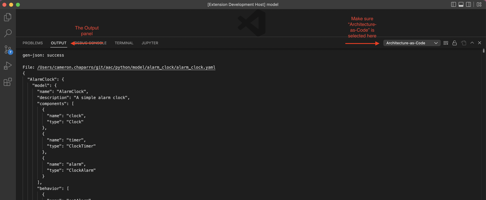

# Running AaC Commands

Running AaC commands from the VSCode extension is straightforward. To do so,
press "F1" and type "aac" to bring up the Architecture-as-Code tasks. You will
notice the option "AaC: Execute AaC Command".

Select this option and you will be presented with a list of AaC commands. Note
that these commands correspond exactly to the commands available when running
the AaC command-line tool.

Once you see this menu, you can execute any of the AaC commands available in the
version of the `aac` tool installed on your system. For example, if I wanted to
run the `gen-json` command, I'd select it from the list:

Once you have picked a command to run, you will then be prompted for any
arguments required by that command.

Some commands have optional arguments. If the chosen command does have optional
arguments, they will be requested and marked as optional. Optional arguments
behave as expected - you can continue past providing an optional argument by
pressing the "Enter" key.

Once values for all arguments have been provided, output from the command will
appear in VSCode's "Output" window under the "Architecture-as-Code" logs.

