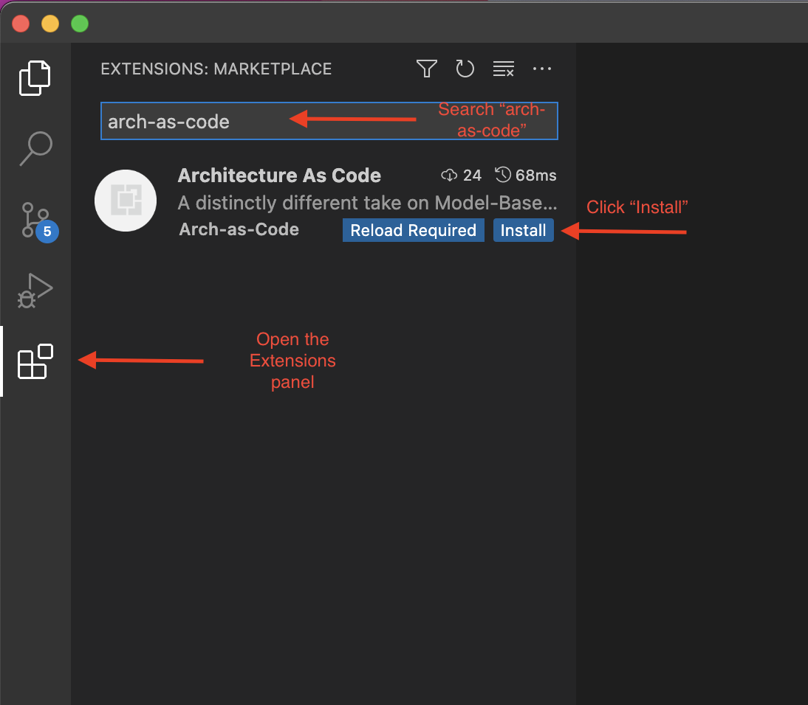
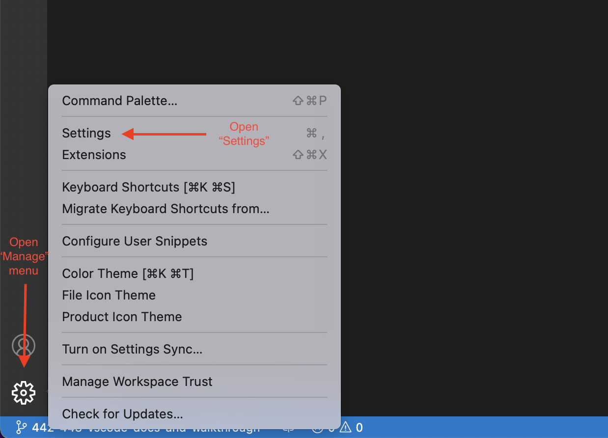
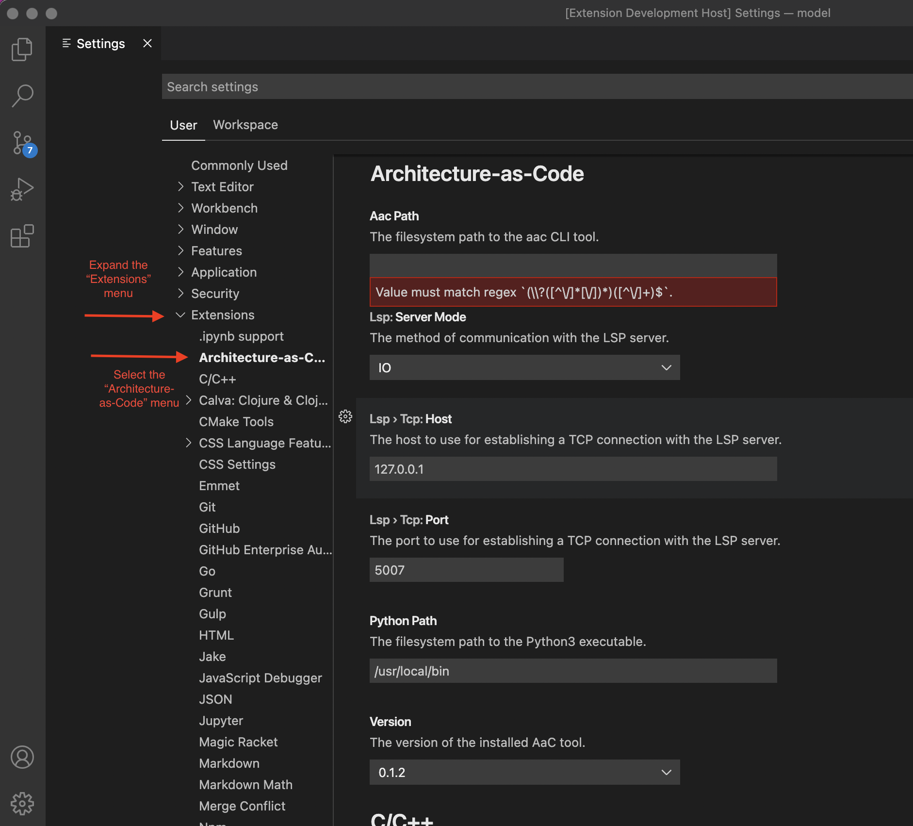
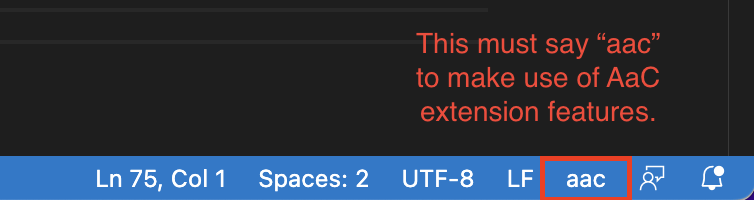

# AaC VSCode Extension

The following describes how to install, configure, and use the VSCode Extension.

This article assumes that Python 3.9+ and VSCode are already installed.

## Pre-requisites

Naturally, to get started using the AaC VSCode extension, one needs to ensure
that the latest version of the AaC Python tool is installed and accessible. To
install the AaC Python tool, it can be installed via `pip` - e.g.
`pip install aac`.

Until further notice, only the official latest version of the AaC tool is
supported by the VSCode extension.

## Install the Extension

To install the AaC VSCode Extension, open the Extensions panel and enter
"arch-as-code" into the search, and install the "Architecture As Code" extension
by clicking the "Install" button.


The AaC VSCode Extension can be found in the
[VSCode Marketplace](https://marketplace.visualstudio.com/items?itemName=Arch-as-Code.aac)
and the [OpenVSX registry](https://open-vsx.org/extension/Arch-as-Code/aac).

## Extension Settings

There are a few settings available to users of the AaC VSCode extension to
customize its function.

To access the VSCode settings for configuring the extension, select the "Manage"
menu in the bottom left corner of the VSCode application and select the
"Settings" option.



Once the "Settings" window is open, select the "Extensions > Architecture-as-Code"
option.



### Aac Path

This refers to the path to the installed AaC tool on the filesystem. If the
`aac` command is available on your `PATH` and you plan to use a single
installation of the AaC tool at any given time, this can be populated with a
value of "aac". It can be helpful, however, to set this value to ensure you are
using the version of the tool you expect.

The expected value, here, would be either "aac" to use the default
globally-installed version of the `aac` tool, or a direct file path to the `aac`
tool.

### LSP

LSP is the [Language Server Protocol](https://microsoft.github.io/language-server-protocol/specifications/lsp/3.17/specification/)
and we have developed a (currently partial) LSP implementation for AaC to assist
users of the language in modeling systems, etc.

#### Server Mode

There are two types of LSP servers available - "IO" and "TCP". Currently, the
server intended for use by users of the AaC language is the "IO" server (which
is the default) but, on occasion, it can be beneficial to run the TCP server for
debugging the tool. In that case, users can switch the "Server Mode" setting to
"TCP". Otherwise, the recommendation is to keep the "Server Mode" as "IO".

##### TCP

Should you choose to use the "TCP" server mode, you will need to start the LSP
TCP server separately. After that, there are further settings to configure in
the VSCode extension.

To start the AaC LSP TCP server, execute the following command:

```bash
aac start-lsp-tcp
```

###### Host and Port

When starting the LSP TCP server, it's possible to specify a host and port on
which to run the server. If you do not specify either the `--host` or the
`--port` options, the defaults will be used. The default host and port are
already set as options in the VSCode extension.

If you choose to use a different host or port, you must specify that in the TCP
settings.

## Extension Features

While we are adding new features regularly, currently the VSCode extension
offers support for:

1. [Executing AaC commands from within VSCode](command_features)
1. [Modeling systems using the AaC Language](lsp_features)

To gain access to any of these features, the AaC extension must be active while
editing your files. To verify that the extension is active, look in the bottom
right corner for "aac" with an open ".yaml" or ".aac" file.



If this says anything other than "aac", then you should click that item and pick
"aac" from the popup to activate the extension for the current file.

For further information on the VSCode Extension features, check out the Extension's readme in the [VSCode Marketplace](https://marketplace.visualstudio.com/items?itemName=Arch-as-Code.aac).
