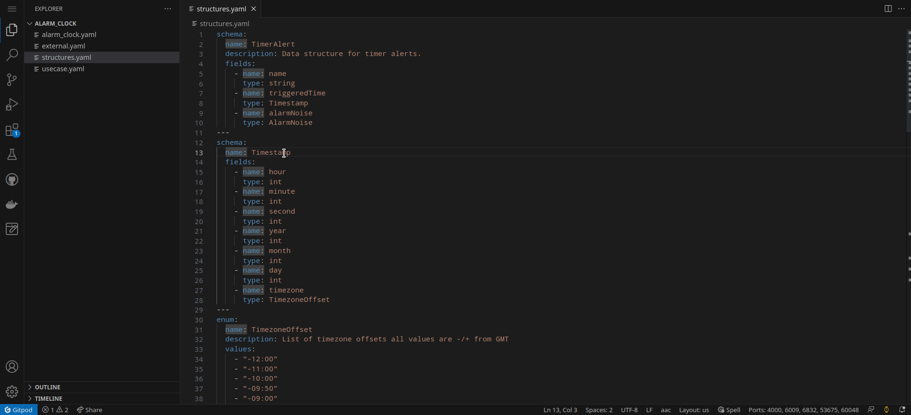
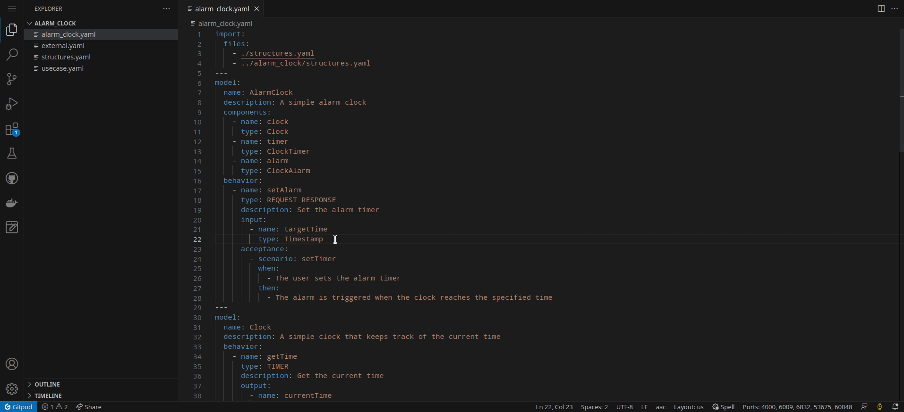
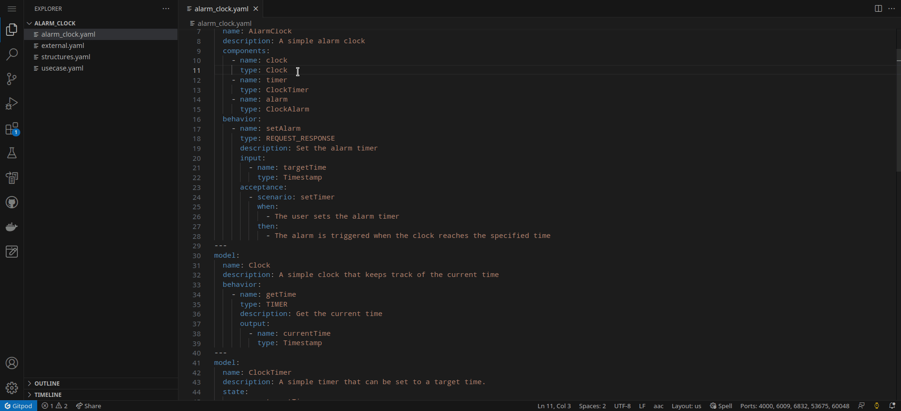
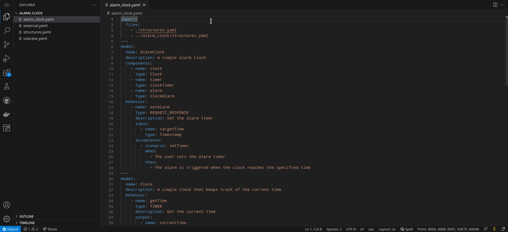
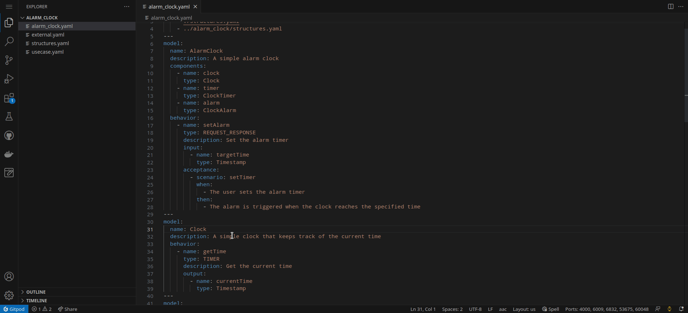
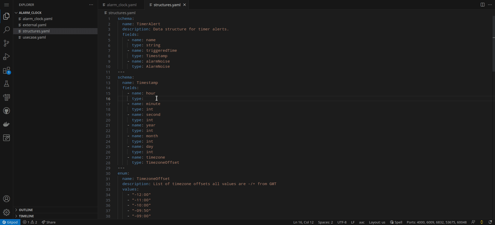
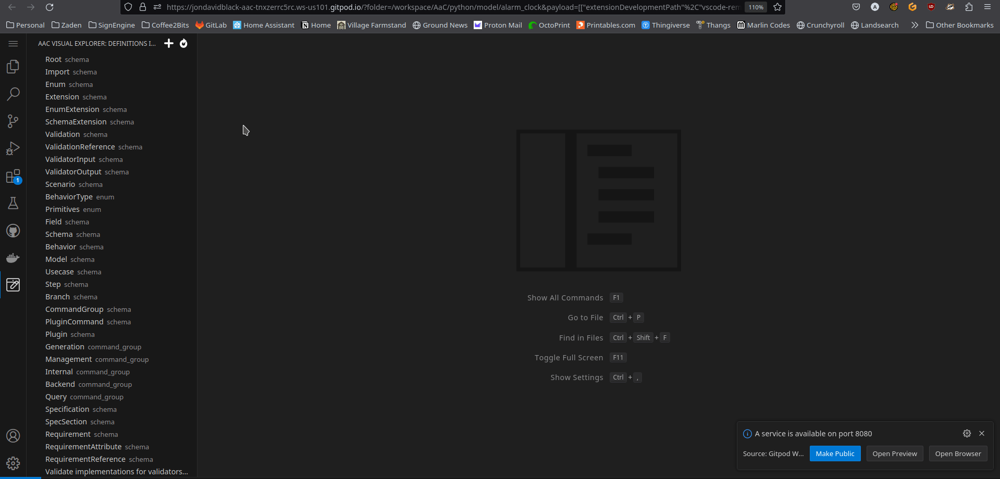

# Architecture-as-Code VSCode Extension

Architecture-as-Code is a novel approach to Model-Based Systems Engineering (MBSE) that captures modeled systems in a YAML-based DSL. AaC's novel approach allows large development teams to overcome team silos that often arise from the use of expensive and proprietary MBSE modeling tools. Because AaC models are captured in YAML, they can be seen and edited by all team members, and the AaC tool is built with automation and CI/CD integration in mind.

The AaC tool is a Python3 Package and can be found on PyPI under the name [aac](https://pypi.org/project/aac/). For more information on the AaC tool, check out the Github Repository [jondavid-black/AaC](https://github.com/jondavid-black/AaC).

## Features


### AaC Command Passthrough

The AaC VSCode Extension allows users to execute AaC commands without having to access the terminal. Start a VSCode command with `F1` and type `AaC: Execute AaC Command`.

### Architecture-as-Code Language Server (LSP)

The AaC tool implements the Language Server Protocol (LSP), and the AaC VSCode Extension integrates with the tool's LSP features to bring common programming IDE features to the AaC DSL and AaC files.

#### Rename

AaC supports renaming, which performs a workspace-wide rename of a symbol.

AaC currently only supports renaming Definition names -- an important feature given that Definition names are used to reference other modeled components and behaviors.


#### Go To/Find All References

AaC supports finding references, which performs a workspace-wide search for any symbols referencing the targetted item.



#### Go To Definition

AaC supports go to definitions, which performs a workspace-wide search for the declaration of a particular symbol.



#### Diagnostics

AaC provides real-time validation and diagnostics. These diagnostics are driven by the AaC tool's core command `validate`.



#### Document Linking

Document linking allows the IDE to provide clickable navigation links between AaC files.



#### Hover (Preview)

AaC provides a preview of AaC definitions when you hover any reference to them.



#### Code Completion

AaC supports code completion in order to ease developers' experience when modeling in AaC.

Currently, the support for code completion is limited, but further expansion is planned for the future.



### Visual Definition Editor (Alpha)

The AaC VSCode extension can leverage the AaC python package's `rest-api` plugin to provide VSCode users with an in-IDE visual editor for AaC definitions.

Before getting started, make sure that you have the AaC `rest-api` plugin running in your project directory.
```bash
aac rest-api --host <hostname|localhost> --port <8000>
```



## Getting Started

The AaC VSCode extension does not require configuration as long as the `aac`
Python tool is in your system `PATH`. Nonetheless, there are configuration options
available, so for detailed instructions on configuring the AaC VSCode Extension,
refer to the [AaC VSCode Extension](https://jondavid-black.github.io/AaC/docs/vscode_extension) github page.

### Setting: Server Mode

There are two types of LSP servers available - "IO" and "TCP". Currently, the
server intended for use by users of the AaC language is the "IO" server (which
is the default) but, on occasion, it can be beneficial to run the TCP server for
debugging the tool. In that case, users can switch the "Server Mode" setting to
"TCP". Otherwise, the recommendation is to keep the "Server Mode" as "IO".

##### TCP

Should you choose to use the "TCP" server mode, you will need to start the LSP
TCP server separately. After that, there are further settings to configure in
the VSCode extension.

To start the AaC LSP TCP server, execute the following command:

```bash
aac start-lsp-tcp
```

##### Host and Port

When starting the LSP TCP server, it's possible to specify a host and port on
which to run the server. If you do not specify either the `--host` or the
`--port` options, the defaults will be used. The default host and port are
already set as options in the VSCode extension.

## Requirements

This plugin relies on the Python package [`aac`](https://pypi.org/project/aac/).
In order to use this plugin, you must install `aac` locally. See the [AaC
Repository](https://github.com/jondavid-black/AaC#using-aac-to-model-your-system)
for how to install the AaC package.

Once the `aac` package is installed, verify that the installation is working
correctly by running `aac -h` in a terminal. If you are presented with a list of
commands with accompanying descriptions, the installation was successful.

## Known Issues

### LSP
* Sometimes the LSP will get into a bad state and won't be responsive. When experiencing this, you can reload the window using the VSCode Command `Developer: Reload Window`.

### Visual Editor
* The Visual Editor is in an early prototype mode, and so there are some issues such as a lack of feedback when a user saves a definition via the visual editor.
* Files with the extension `.yaml` are not automatically imported unlike files with the `.aac` extension.
